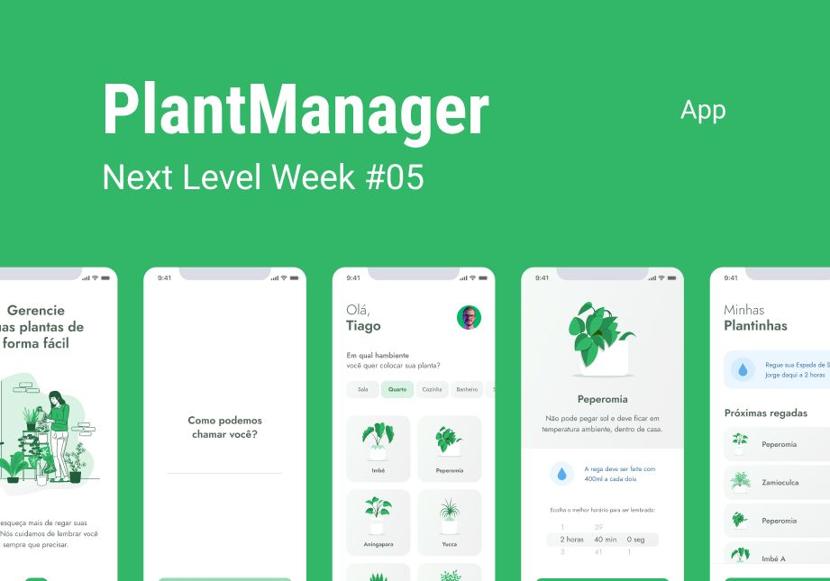

<h1 align="center">PlantManager</h1>

  

## Project

Mobile application (PlantManager) to remind you to water your plants at the correct time according to each plant, in addition to giving some tips and information about the plants.

## Technologies

This project was developed with the following technologies:

- [TypeScript](https://www.typescriptlang.org/)
- [Expo](https://expo.io/)
- [React Native](https://reactnative.dev/)
- [json-server](https://github.com/typicode/json-server)
- [Lottie](https://github.com/lottie-react-native/lottie-react-native)

## Layout

You can view the project layout through this [link](https://www.figma.com/file/VME3uZhNF0JkStiNtkCXO1/PlantManager?node-id=0%3A1). Figma account is required to access it.

## How to run

- Clone the repository
- Access project directory
- Install dependencies with `yarn`
- Start json-server with `json-server ./src/services/server.json --host your ip here --port 3333`
- Start the expo with `expo start`, `yarn start` or `npm start`

## License

This project is under the MIT license. See the [LICENSE](LICENSE.md) file for more details.